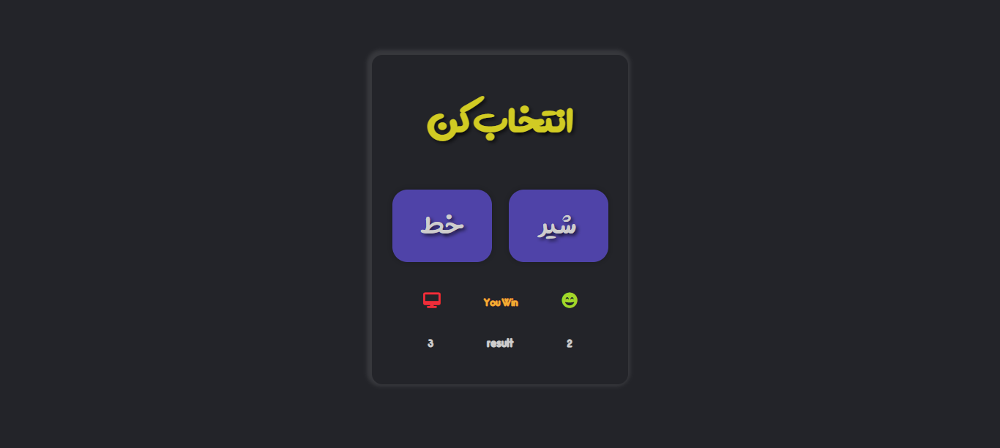

# Coin Game

This project is a simple JavaScript application designed for educational purposes to practice and better understand JavaScript methods.

## Introduction

The Coin Game project provides a fun and interactive way to learn various JavaScript methods and concepts. The objective of the game is to flip a virtual coin and predict whether it will land on heads or tails. By checking codes of the game, users can improve their understanding of JavaScript methods and enhance their programming skills.

## Features

- Coin flipping: The game allows users to simulate coin flips and make predictions.
- Randomness: The outcome of each coin flip is randomized to provide an authentic experience.
- Score tracking: The game keeps track of the user's score, displaying the number of correct predictions.
- Feedback: Users receive immediate feedback on their predictions, helping them learn from their mistakes.
- Reset option: The game can be easily reset to start over and continue practicing.

## Installation

To run the Coin Game locally on your machine, follow these steps:

1. Clone the repository:
   
    `git clone https://github.com/sadeq-yaqobi/coin-game.git`

2. Navigate to the project directory:

    `cd coin-game`

3.  Open the index.html file in your preferred web browser.

## Usage
Once the Coin Game is running in your web browser, follow these instructions to play:

1. Click on the "Flip Coin" button to simulate a coin flip.
2. Predict whether the coin will land on heads or tails.
3. After making a prediction, the game will reveal the outcome and provide feedback.
4. Keep playing and try to improve your prediction accuracy.
5. To reset the game, click on the "Reset" button.
## Contributing
Contributions to enhance and improve the Coin Game project are always welcome. If you would like to contribute, please follow these steps:

1. Fork the repository.
2. Create a new branch for your feature or bug fix.
3. Make the necessary changes and commit them.
4. Push your changes to your forked repository.
5. Submit a pull request detailing your changes.

## Acknowledgments
This project was inspired by the desire to create an engaging educational tool for learning JavaScript methods. Special thanks to the contributors and open-source projects that made this project possible.

